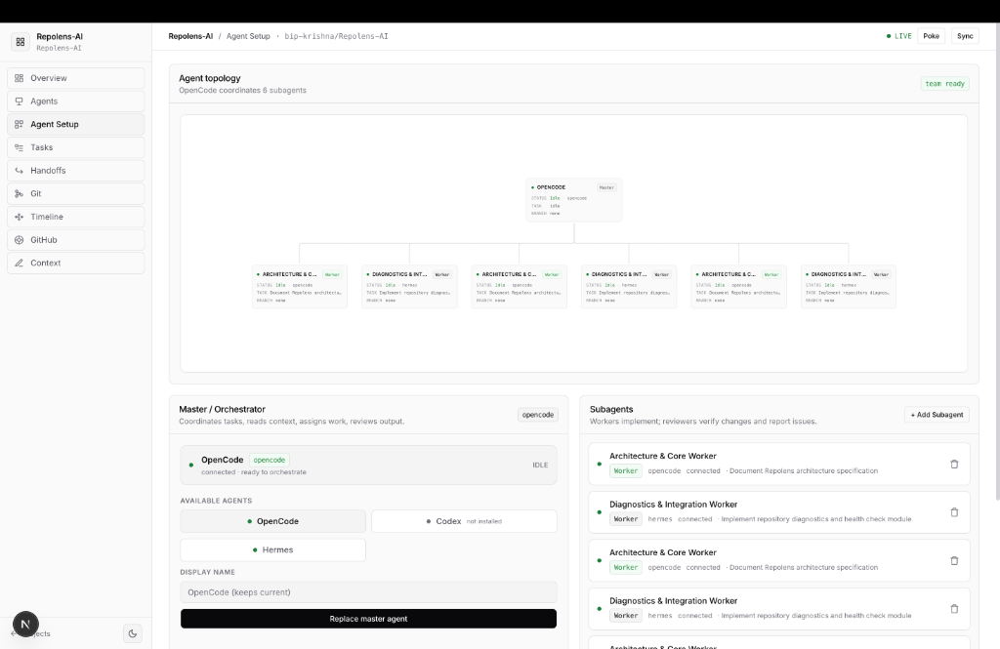
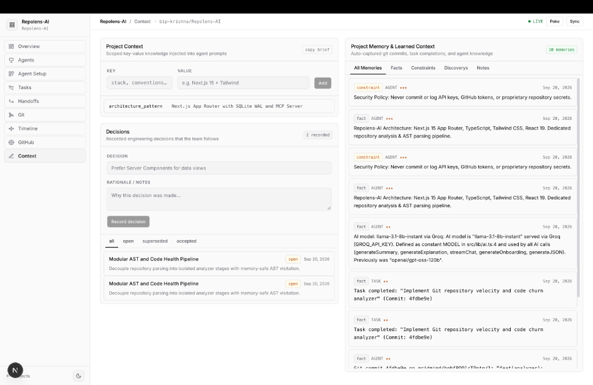
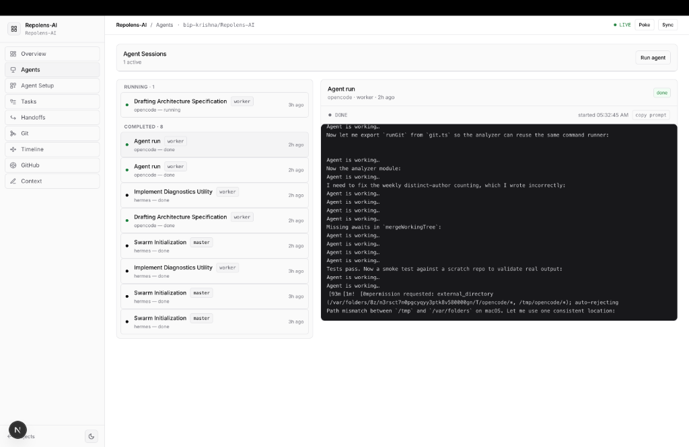
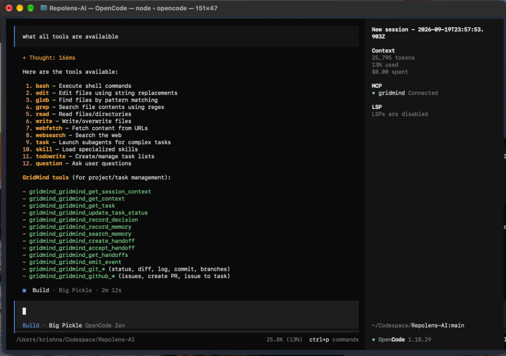

# GridMind 🧠⚡

> **Autonomous AI Agent Control & Coordination Plane for Software Engineering**  
> Unifies **Full-Stack Web Dashboard + Sandboxed Git Worktrees + Model Context Protocol (MCP) + Autonomous Agent Swarms + Structured Handoffs + GitHub PRs** into one cohesive developer workflow.

---

## Overview

**GridMind** is a complete coordination and control plane designed specifically for multi-agent software engineering. Instead of running AI coding assistants as isolated chat toys or allowing multiple agents to trample over a single Git working directory, GridMind bridges human developers and autonomous AI coding agents (OpenCode, Codex, Claude Code, Cursor, and Hermes) into a structured, production-ready engineering lifecycle.

GridMind consists of **two unified parts**:

### Part 1: The Web Application & Visual Control Plane
A real-time Next.js web application ([http://localhost:3000](http://localhost:3000)) that provides human engineers with full visibility and control:
* **Interactive Coordination Canvas**: A live node graph (built with React Flow) displaying tasks, assigned agents, branch statuses, active handoffs, and GitHub PR links.
* **Worktree & Task Orchestrator**: One-click provisioning of isolated Git worktrees and task assignment for agents.
* **Dual-View Context & Memory Dashboard**: Visualizes persistent project key-value metadata alongside a real-time chronological stream of auto-captured Git commits, task events, constraints, and architectural decisions.
* **Real-Time Event Stream**: Server-Sent Events (SSE) broadcasting live agent commits, status updates, and handoffs with zero page refreshes.

### Part 2: The MCP Server & Autonomous Agent Swarm Engine
A standalone **Model Context Protocol (MCP)** server (`dist/mcp/cli.mjs`) operating over standard I/O (`stdio`):
* **20 Specialized MCP Tools**: Equips any MCP-compatible agent (OpenCode, Claude Desktop, Cursor, Hermes) with tools for Git operations, GitHub PRs/issues, memory search, context synchronization, and structured handoffs.
* **Strict Worktree Sandboxing**: Ensures each agent executes strictly inside its task-specific Git worktree on an isolated branch, completely preventing file collisions.
* **Structured Agent-to-Agent Handoffs**: Formally transfers state between agents using commit SHA references, modified file manifests, decisions, blockers, and next steps.
* **Automated Context Ingestion**: Automatically records every commit and task status update into SQLite, keeping the entire agent swarm synchronized.

---

## Problem Statement

As AI coding agents evolve from single-file autocomplete tools into autonomous software engineers, scaling them across real multi-step software features breaks down due to critical architectural gaps:

1. **Working Tree Collisions**: When multiple agents work simultaneously on the same repository branch, they overwrite each other's files, introduce merge conflicts, and corrupt uncommitted code.
2. **Context Amnesia & Token Window Explosion**: AI agents either lose critical architectural decisions between turns, or blow past LLM context windows by dumping massive git diffs, file trees, and chat logs into prompts.
3. **Unstructured Agent Handoffs**: When Agent A finishes a backend API and Agent B must build the corresponding frontend UI, there is no standardized mechanism to pass commit SHAs, changed file manifests, architectural trade-offs, blockers, and next steps.
4. **Lack of Human Observability**: Developers have no single pane of glass to observe what multiple agents are doing across disparate branches, what commits they are producing, or where bottlenecks occur.
5. **Walled Gardens vs. Open Protocols**: Most agent harnesses operate in proprietary silos rather than integrating into existing developer environments via standardized protocols like MCP.

---

## Solution

GridMind provides a unified infrastructure plane combining a **developer control dashboard** with an **autonomous agent execution protocol**:

```
┌────────────────────────────────────────────────────────────────────────────────────────┐
│                               GRIDMIND CONTROL PLANE                                    │
│                                                                                        │
│   PART 1: WEB DASHBOARD & UI                       PART 2: MCP SERVER & AGENTS          │
│   ┌──────────────────────────────┐                 ┌──────────────────────────────┐    │
│   │ Interactive Node Graph       │◄── SSE Events ──┤ Standalone MCP CLI           │    │
│   │ (Tasks, Agents, Handoffs, PR)│                 │ (dist/mcp/cli.mjs)           │    │
│   ├──────────────────────────────┤                 ├──────────────────────────────┤    │
│   │ Dual Context & Memory View   │◄─ Auto Ingest ──┤ 20 MCP Tools                 │    │
│   │ (Key-Values + Commit Stream) │                 │ (Git, Handoffs, Memory, PRs) │    │
│   ├──────────────────────────────┤                 ├──────────────────────────────┤    │
│   │ Worktree Manager & Status    │◄── State Sync ──┤ OpenCode / Claude / Cursor   │    │
│   └──────────────────────────────┘                 └──────────────────────────────┘    │
└────────────────────────────────────────────────────────────────────────────────────────┘
                                           │
                        ┌──────────────────┴──────────────────┐
                        ▼                                     ▼
           ┌─────────────────────────┐           ┌─────────────────────────┐
           │ Task A Worktree         │           │ Task B Worktree         │
           │ Branch: gridmind/<id>/1 │           │ Branch: gridmind/<id>/2 │
           │ Agent A (Backend API)   │           │ Agent B (Frontend UI)   │
           └────────────┬────────────┘           └────────────▲────────────┘
                        │                                     │
                        └─────── Structured Handoff ──────────┘
                                (Commit Ref + Decisions)
                                           │
                                           ▼
                                GitHub Pull Request (PR)
```

### How the Two Parts Work Together:
1. **The Human Engineer** uses the **Web Dashboard (Part 1)** to create projects, define tasks, and click "Provision Worktree".
2. **The Autonomous Agents** connect via the **MCP Server (Part 2)** using OpenCode, Cursor, or Claude Desktop, operating strictly within their isolated worktrees.
3. **Automatic Synchronization**: Whenever an agent commits code (`gridmind_git_commit`) or marks a task complete, GridMind automatically updates the project context, writes to SQLite, and fires a real-time SSE event that updates the Web Dashboard canvas and context stream instantly.
4. **Structured Handoff**: Agent A finishes its work and creates a handoff referencing its commit SHA. Agent B accepts the handoff, inspects the commit diff on-demand, and continues development.
5. **PR Creation**: When the swarm finishes, a GitHub Pull Request is generated directly via MCP and linked on the dashboard.

---

## Features

### Part 1: Web Dashboard & Visual Orchestration
* **Interactive Live Coordination Canvas**: Visual node graph powered by `@xyflow/react` showing task dependencies, agent states, commit SHAs, active handoff edges, and GitHub PR badges.
* **Worktree & Task Management**: Easily create tasks, assign agents (`opencode`, `hermes`, `claude`), provision isolated Git worktrees, and monitor live status.
* **Dual-View Context & Memory Dashboard**:
  * **Project Context**: Live key-value metadata (`architecture_pattern`, `tech_stack`, `latest_commit`) with inline editing and a one-click "Copy Brief" button.
  * **Learned Memory Stream**: Real-time chronological timeline of auto-captured Git commits, task completions, architectural facts, and constraints with importance ratings (★) and source badges.
* **Decisions Log**: Dedicated panel tracking architectural trade-offs with status filtering (`proposed`, `accepted`, `superseded`).
* **Real-Time SSE Event Stream**: Live activity updates streamed directly from the backend with zero page reloads.

### Part 2: MCP Server & Autonomous Agent Swarm Execution
* **20 Native Model Context Protocol Tools**: Comprehensive tool suite spanning Git operations, GitHub integration, structured handoffs, memory management, and task status.
* **Isolated Git Worktree Sandboxing**: Automated provisioning of sandboxed directories (`.gridmind-worktrees/<project>/<task>`) on dedicated branches (`gridmind/<task>/1`), preventing file collisions.
* **Structured Handoff Pipeline**: First-class handoff primitives (`create_handoff`, `get_handoffs`, `accept_handoff`) containing commit SHA references, changed files, decisions, blockers, and next steps.
* **Automatic Context & Memory Ingestion**: Every agent commit and task completion is automatically indexed into SQLite with WAL mode and surfaced on both the Web UI and MCP context tools.
* **Universal Agent Compatibility**: Works out of the box with OpenCode, Claude Desktop, Cursor, and custom CLI agents (Hermes, Codex).
* **Enterprise Security Invariants**: Worker tokens are strictly bound to their task worktree; path traversal (`../`) is rejected; diff outputs are bounded to 30,000 characters; and zero credentials or private tokens are leaked.

---

## Tech Stack

* **Frontend (Dashboard):** Next.js 15 (App Router), React 19, TypeScript, Tailwind CSS, `@xyflow/react` (React Flow), Lucide Icons, GSAP animations.
* **Backend & API:** Next.js Route Handlers (Node.js runtime), Server-Sent Events (SSE) for live event streaming.
* **Database & Persistence:** SQLite with Write-Ahead Logging (WAL) via `better-sqlite3`.
* **Agent Integration & Protocols:** Model Context Protocol (`@modelcontextprotocol/sdk`), GitHub REST API (`@octokit/rest`).
* **MCP Server Binary:** Standalone Node.js bundle compiled via `esbuild` to `dist/mcp/cli.mjs`.
* **Validation & Security:** `zod` schema validation, cryptographic `nanoid` identifiers, canonical path verification.
* **Hosting / Deployment:** Node.js 18+ / 20+ runtime (macOS / Linux / Windows).

---

## Codex / OpenAI Usage

During the design, development, and testing of GridMind, AI tools—including **Codex**, **OpenCode**, and **ChatGPT/OpenAI APIs**—were utilized extensively across both parts of the system:

* **Protocol & Handoff Schema Design**: OpenAI models were used during the architecture phase to design the structured agent handoff schema, define token-budgeted memory retrieval algorithms, and establish the 20-tool Model Context Protocol surface.
* **Dogfooding with Autonomous Agent Swarms**: We used OpenCode and Codex-powered agents to dogfood GridMind directly on real repositories (including [Repolens-AI](https://github.com/bip-krishna/Repolens-AI)). Agents were assigned isolated tasks, used GridMind MCP to inspect bounded diffs and commit changes in their sandboxed worktrees, and successfully passed structured handoffs to downstream agents.
* **Full-Stack Implementation Assistance**: AI assisted in building both the Next.js frontend (React Flow custom nodes, dual-view context panel, dark mode styling) and the backend (Git worktree lifecycle engine, esbuild MCP bundling pipeline, reactive SSE event bus).
* **Security Red-Teaming & Hardening**: OpenAI models helped audit and stress-test security invariants, identifying path traversal vectors (`../`), validating token isolation between worker sessions, and verifying bounded output truncation.
* **Comprehensive Test Authoring**: AI helped write 11 automated test suites covering 671 assertions across agent lifecycles, memory isolation, cross-task handoffs, and MCP tool execution.

---

## Demo

### Live Demo
* **Local Web Dashboard**: [http://localhost:3000](http://localhost:3000) (run `npm run dev`)


> **Demo Walkthrough**: The demo highlights a complete 2-agent swarm tackling a full-stack feature on a real codebase:
> 1. **Human Operator (Part 1 - Web UI)**: Creates a project, defines Task A ("Implement backend auth") and Task B ("Build frontend login UI"), and provisions worktrees.
> 2. **Agent A (Part 2 - MCP / OpenCode)**: Connects to Task A's worktree, implements the JWT authentication module, and commits via `gridmind_git_commit`. The commit is auto-captured in project memory and updates `latest_commit`. Agent A creates a structured handoff referencing commit `4617cfb`.
> 3. **Agent B (Part 2 - MCP / OpenCode)**: Retrieves the handoff, inspects Agent A's commit diff, implements the frontend login UI, and commits via MCP.
> 4. **Delivery & Verification (Part 1 - Web UI)**: The human operator watches the live React Flow canvas update in real-time, inspects the learned context timeline, and triggers the automated GitHub Pull Request creation.

---

## Screenshots

### 1. Multi-Agent Swarm Topology & Setup (Web Dashboard)
*OpenCode master orchestrator supervising specialized worker subagents (`Architecture & Core Worker`, `Diagnostics & Integration Worker`) with live swarm status and one-click role replacement.*



---

### 2. Dual Context & Learned Memory Dashboard (Web Dashboard)
*Left: Persistent project key-value store (`architecture_pattern`) with one-click brief copy and architectural decision log. Right: Real-time chronological memory stream capturing agent commits, task milestones, security policies, and importance badges (★).*



---

### 3. Agent Execution Sessions & Real-Time Terminal Logs (Web Dashboard)
*Monitoring active and completed worker sessions, execution duration, and live terminal output streamed from agents operating inside isolated task worktrees.*



---

### 4. External Agent MCP Integration (OpenCode Terminal)
*OpenCode connected directly to the GridMind Model Context Protocol server (`MCP • gridmind Connected`), displaying available tools and utilizing GridMind's 20 native Git, task, handoff, and memory MCP tools.*



---

## How to Run Locally

### Prerequisites
- **Node.js**: Version `18.0.0` or higher (`v20+` recommended). Check with `node -v`.
- **npm**: Version `9.0.0` or higher. Check with `npm -v`.
- **Git**: Version `2.20+` (must support `git worktree`). Check with `git --version`.

---

### Step 1: Clone & Install

```bash
# Clone the repository
git clone https://github.com/bip-krishna/Gridmind.git
cd Gridmind

# Install dependencies
npm install
```

---

### Step 2: Configure Environment Variables

```bash
# Copy example environment configuration
cp .env.example .env.local
```

*(Optional)* Edit `.env.local` if you plan to use GitHub PR creation or GitHub Issues import:
```env
# Required only for GitHub PR creation or GitHub Issues import
GITHUB_TOKEN=ghp_yourPersonalAccessTokenHere
```
*(If `GITHUB_TOKEN` is omitted, GridMind runs normally in local-only Git mode).*

---

### Step 3: Build the MCP Server & Start the Web App

```bash
# 1. Build the standalone Model Context Protocol (MCP) server
npm run build:mcp

# 2. Start the Next.js development server
npm run dev
```

Open your browser to:  
👉 **[http://localhost:3000](http://localhost:3000)**

---

### Step 4: Step-by-Step Web UI Guide (Part 1)

1. **Create a Project**: Click **"+ New Project"**, enter a name and the absolute path to any local Git repository (e.g., `/Users/you/my-project`).
2. **Define Tasks**: Open the **Tasks** panel and create:
   - **Task A**: `Implement auth service` (Assignee: `opencode`)
   - **Task B**: `Build login interface` (Assignee: `opencode`)
3. **Provision Worktrees**: Click **"Provision Worktree"** for each task. GridMind creates sandboxed worktrees under `.gridmind-worktrees/<project_id>/<task_id>` on isolated branches.
4. **Inspect Context**: Click the **Context** tab to view your project's key-value context table and live memory stream.

---

### Step 5: Connecting External MCP Clients (Part 2)

#### 1. Retrieve an Active Token
In a separate terminal, retrieve an active master token from GridMind's SQLite database:
```bash
sqlite3 .gridmind/gridmind.db "SELECT token, role, project_id FROM sessions WHERE role='master' ORDER BY created_at DESC LIMIT 1;"
```

#### 2. OpenCode Configuration (`~/.config/opencode/opencode.jsonc`)
Add GridMind to your OpenCode configuration:
```jsonc
{
  "$schema": "https://opencode.ai/config.json",
  "mcpServers": {
    "gridmind": {
      "command": "node",
      "args": ["/Users/krishna/Codespace/Agentmind/dist/mcp/cli.mjs"],
      "env": {
        "GRIDMIND_API": "http://localhost:3000",
        "GRIDMIND_TOKEN": "<YOUR_SESSION_TOKEN_FROM_STEP_1>"
      }
    }
  }
}
```
*(Replace the path to `dist/mcp/cli.mjs` with your absolute installation path).*

#### 3. Launch OpenCode
```bash
opencode
```
Inside OpenCode, prompt the model:
> *"What tools are available?"* or *"Use gridmind_get_context to check the project state."*

#### Claude Desktop Configuration (`claude_desktop_config.json`)
```json
{
  "mcpServers": {
    "gridmind": {
      "command": "node",
      "args": ["/absolute/path/to/Agentmind/dist/mcp/cli.mjs"],
      "env": {
        "GRIDMIND_API": "http://localhost:3000",
        "GRIDMIND_TOKEN": "<YOUR_SESSION_TOKEN>"
      }
    }
  }
}
```

#### Cursor Configuration (`.cursor/mcp.json` or Settings → MCP Servers)
```json
{
  "mcpServers": {
    "gridmind": {
      "command": "node",
      "args": ["/absolute/path/to/Agentmind/dist/mcp/cli.mjs"],
      "env": {
        "GRIDMIND_API": "http://localhost:3000",
        "GRIDMIND_TOKEN": "<YOUR_SESSION_TOKEN>"
      }
    }
  }
}
```

---

### Step 6: Running the Automated End-to-End Swarm Demo

GridMind includes a fully automated 15-step script demonstrating the complete multi-agent workflow:
```bash
# Ensure npm run dev is running in terminal 1, then in terminal 2:
node scripts/stage5c-demo.mjs
```

---

## Additional Notes

### MCP Tools Reference (All 20 Tools)

| Category | Tool | Parameters | Description |
|---|---|---|---|
| **Context & Memory** | `gridmind_set_context` | `key`, `value` | Persists or updates a persistent project context key-value entry (immediately visible in Web UI). |
| | `gridmind_get_context` | `taskId?` | Retrieves token-budgeted project brief, task details, and incoming handoffs. |
| | `gridmind_get_session_context` | _none_ | Inspects authenticated agent session, task assignment, and role. |
| | `gridmind_record_memory` | `content`, `type`, `importance?`, `scope?` | Records a knowledge item (`fact`, `constraint`, `decision`) into project or task memory. |
| | `gridmind_search_memory` | `query`, `type?`, `scope?` | Searches memories using semantic query matching. |
| | `gridmind_record_decision` | `summary`, `rationale`, `status?` | Records an architectural decision in the project decision log. |
| | `gridmind_get_task` | `taskId?` | Inspects the assigned task details, status, and branch. |
| | `gridmind_update_task_status` | `status`, `notes?` | Updates task status (`in_progress`, `blocked`, `done`, `failed`). Auto-records memory on completion. |
| | `gridmind_emit_event` | `event`, `data?` | Emits custom project events to the live SSE stream. |
| **Git Operations** | `gridmind_git_status` | `taskId?` | Returns clean/dirty state, branch, changed files, and ahead/behind count for the worktree. |
| | `gridmind_git_diff` | `path?`, `staged?`, `commit?`, `taskId?` | Returns bounded diff (unstaged, staged, or against a commit SHA). Rejects path traversal (`../`). |
| | `gridmind_git_commit` | `message`, `taskId?` | Commits changes in the worktree. Updates task record and auto-records commit to memory and context. |
| | `gridmind_git_branches` | _none_ | Lists branches in the project repository (bounded to 50). |
| | `gridmind_git_log` | `limit?`, `commit?` | Returns recent bounded commits (default 10, max 50) with commit lookup. |
| **Handoffs** | `gridmind_create_handoff` | `target_task_id`, `summary`, `completed_work`, `changed_files`, `decisions`, `blockers`, `next_steps`, `commit_sha`, `branch` | Creates a structured handoff transferring state from one agent/task to another. |
| | `gridmind_get_handoffs` | `taskId?` | Retrieves handoffs targeted at or created by the agent's task. |
| | `gridmind_accept_handoff` | `handoff_id` | Accepts an incoming handoff idempotently. |
| **GitHub** | `gridmind_github_issues` | `state?` | Lists open issues for the project-configured GitHub repository. |
| | `gridmind_github_create_pr` | `title`, `body`, `head_branch`, `base_branch` | Creates a Pull Request using the project-configured repository. |
| | `gridmind_github_issue_to_task` | `issue_number`, `priority?` | Converts a GitHub issue into a GridMind task with worktree isolation. |

---

### Running Tests

GridMind is backed by a 671-test automated suite covering all lifecycles, memory isolation, and MCP tools:

```bash
node tests/agent-api.mjs && \
node tests/stage2-lifecycle.mjs && \
node tests/audit-regression.mjs && \
node tests/stage3-worktree.mjs && \
node tests/stage4-memory.mjs && \
node tests/stage4-retrieval.mjs && \
node tests/stage4-security.mjs && \
node tests/stage4-task-auth.mjs && \
node tests/mcp-stage5a.mjs && \
node tests/stage5b-handoffs.mjs && \
node tests/stage5c-git-github.mjs
```

### Static Checks & Linting
```bash
npx tsc --noEmit    # TypeScript typecheck
npm run lint        # ESLint
```

---

### Security Invariants
* **Worktree Path Derivation**: Worker agents cannot supply arbitrary filesystem paths; worktrees are derived server-side via `session.task_id → task.worktree_path`.
* **Path Traversal Protection**: All diff paths and worktree operations verify canonical paths and reject `../`.
* **Zero Credential Leaks**: `GITHUB_TOKEN`, session auth tokens, and private database credentials are never returned in MCP outputs or emitted in SSE event logs.
* **Token Budgeting**: Bounded diffs (30k char ceiling) and memory retrieval budgeting (1,000 tokens max) protect LLMs from context window exhaustion.

---

### Future Roadmap
* **Ephemeral Cloud Worktrees**: Spin up sandboxed remote micro-VMs / Firecracker containers for untrusted agent code execution.
* **Adversarial Agent PR Reviews**: Automated adversarial reviewer agents that analyze code diffs and test coverage before allowing merges.
* **Decentralized Multi-Node Swarms**: Peer-to-peer agent coordination over WebRTC/WebSocket across distributed developer machines.

### DEMOS
https://drive.google.com/drive/folders/12Kn8fREOfxuj3BH6TYHzRo-s6AnFxXIe?usp=sharing


